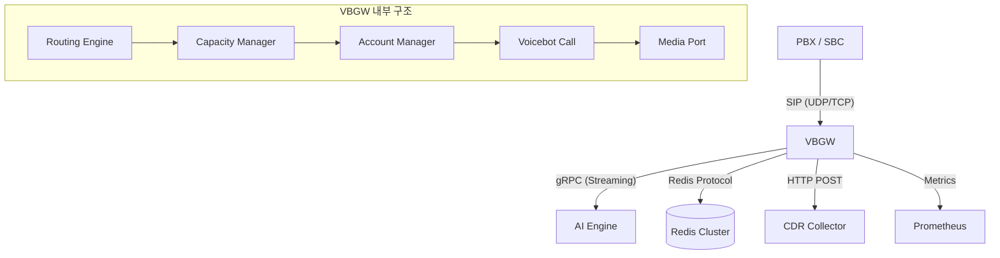

# AI Voicebot Gateway (VBGW)

**VBGW**는 PBX/SBC(SIP)와 AI 엔진(gRPC) 사이를 연결하는 고성능 엔터프라이즈급 미디어 게이트웨이입니다. PJSIP 스택을 기반으로 C++로 작성되었으며, 대규모 콜센터 환경에서 필요한 분산 용량 제어, 고가용성(HA), 그리고 AI 대화 품질 보호 기능을 내장하고 있습니다.

---

## 문서 빠른 시작

실제 소스를 수정하거나 운영 절차를 따라가려면 아래 문서를 먼저 보세요.

1. [상세 사용자·개발자 매뉴얼](docs/user_manual_ko.md)
2. [상세 운영자 매뉴얼](docs/operator_manual_ko.md)
3. [개발자 커스터마이징 가이드](docs/developer_customization_ko.md)
4. [트러블슈팅 가이드](docs/troubleshooting.md)

---

## 1. 프로젝트 개요 (Overview)

이 게이트웨이는 전통적인 전화망(SIP)의 복잡한 신호 처리와 현대적인 AI 엔진의 스트리밍 인터페이스를 중계합니다. 단순히 소리를 전달하는 것을 넘어, 서비스별로 할당된 상담원(슬롯) 수를 관리하고, 서버 과부하 시 지능적으로 전화를 다른 곳으로 돌리거나(302 Redirect), AI의 응답이 늦어질 때 사용자에게 안내 멘트를 들려주는 등 **운영 안정성**에 최적화되어 있습니다.

### 핵심 가치
- **분산 확장성**: Redis를 통해 여러 대의 게이트웨이가 하나의 서비스 용량을 공유 관리합니다.
- **고가용성**: 메인 PBX 장애 시 서브 PBX로 즉시 자동 페일오버를 수행합니다.
- **운영 투입 준비**: 상세한 Prometheus 지표와 비동기 Webhook 기반의 통화 기록(CDR)을 제공합니다.

---

## 2. 주요 기술 요소 (Tech Stack)

| 분류 | 기술 | 용도 |
| :--- | :--- | :--- |
| **언어 및 빌드** | C++20, CMake | 고성능 비동기 처리 및 모던 컴파일러 환경 |
| **통신 스택** | PJSIP (PJSUA2) | SIP 신호 처리 및 RTP 미디어 엔진 |
| **AI 연동** | gRPC | AI 엔진과의 실시간 오디오 스트리밍 (STT/TTS) |
| **분산 관리** | Redis, redis-plus-plus | 다중 노드 간 슬롯 점유 및 분산 락 구현 |
| **데이터 전송** | libcurl | 비동기 Webhook (JSON CDR) 전송 |
| **미디어 처리** | SpeexDSP, Silero VAD | 잡음 제거(Denoise), 자동 음량 조절(AGC), 음성 구간 감지 |
| **관측성** | Boost.Asio, spdlog | Prometheus 메트릭 서버 및 구조화된 로깅 |

---

## 3. 시스템 아키텍처 (Architecture)



1.  **Routing Layer**: `routing.yaml`에 따라 인입된 번호를 논리적 서비스로 매핑합니다.
2.  **Capacity Layer**: Redis를 활용해 전역/서비스별 동시 통화 수를 제어합니다.
3.  **Media Layer**: SpeexDSP로 전처리된 음성을 AI 엔진에 전달하고 TTS를 재생합니다.
4.  **Defense Layer**: AI 지연 시 쿠션 메시지를 재생하고 무한 대화를 차단(Capping)합니다.

---

## 4. 실행 환경 및 설치 방법 (Setup Guide)

### 필수 요구 사항
- **OS**: Linux (Ubuntu 20.04+) 또는 macOS
- **의존성 라이브러리**:
  - `OpenSSL 3.x` (gRPC와 libcurl 간 충돌 방지를 위해 통합 버전 필수)
  - `PJSIP (pjproject)`
  - `gRPC` & `Protobuf`
  - `Redis` 서버 (Docker 권장)
  - `libcurl`, `ossp-uuid`

### 빌드 단계
```bash
# 1. 저장소 클론
git clone https://github.com/kchul199/vbgw_pjsip.git
cd vbgw_pjsip

# 2. 빌드 디렉토리 생성
mkdir build && cd build

# 3. CMake 설정 (OpenSSL 경로 주의)
cmake .. -DCMAKE_BUILD_TYPE=Release

# 4. 컴파일
make -j4
```

### 고동시성 SIP 부하 테스트 전 필수 확인

Homebrew의 기본 `pjproject` 패키지는 이 환경에서 컴파일타임 `PJSUA_MAX_CALLS=4`로 빌드되어 있을 수 있습니다. 이 경우 `MAX_CONCURRENT_CALLS=1000`을 설정해도 실제 SIP call slot은 4개로 제한됩니다.

`10 CPS` 이상의 부하 테스트나 `4`를 넘는 동시호 검증이 필요하면 아래 순서로 워크스페이스 안에 커스텀 PJPROJECT를 다시 빌드하십시오.

```bash
./scripts/build_local_pjproject.sh
BUILD_DIR=build-local ./scripts/configure_with_local_pjproject.sh -DCMAKE_BUILD_TYPE=Release
cmake --build build-local
```

기본 커스텀 빌드는 `PJSUA_MAX_CALLS=256`, `PJSUA_MAX_CONF_PORTS=1024`, `PJSIP_MAX_TSX_COUNT=4095`를 사용합니다. 필요하면 `PJ_MAX_CALLS`, `PJ_MAX_CONF_PORTS`, `PJ_MAX_TSX_COUNT` 환경변수로 조정할 수 있습니다.

---

## 5. 실행 및 테스트 (Execution & Testing)

### 환경 변수 설정
실행 전 `.env` 파일 또는 환경 변수를 설정합니다.
```bash
export REDIS_ADDR="tcp://127.0.0.1:6379"
export CDR_WEBHOOK_ENABLE="1"
export CDR_WEBHOOK_URL="http://your-server.com/api/v1/cdr"
export ROUTING_CONFIG_PATH="config/routing.yaml"
```

### 테스트 도구 활용
초보자도 쉽게 기능을 검증할 수 있도록 전용 테스트 유틸리티를 제공합니다.

#### 1) Redis 분산 락 검증
Redis에 슬롯 할당 및 하트비트가 정상 작동하는지 확인합니다.
```bash
./build/verify_redis
```

#### 2) Webhook 비동기 전송 검증
통화 종료 후 CDR 데이터가 외부 서버로 잘 가는지 테스트합니다.
```bash
# 가상 수신 서버 실행 (터미널 1)
python3 tests/mock_webhook_server.py

# 전송 테스트 실행 (터미널 2)
./build/verify_webhook
```

#### 3) 302 Redirect (오버플로우) 검증
`sipp` 툴을 사용하여 용량 초과 시 전화가 돌아가는지 확인합니다.
```bash
./tests/run_302_test.sh
```

---

## 6. 트러블 슈팅 (Troubleshooting)

### Q1. 실행 시 `Segmentation Fault`가 발생합니다.
- **원인**: gRPC(BoringSSL)와 libcurl(OpenSSL) 간의 심볼 충돌일 확률이 높습니다.
- **해결**: `CMakeLists.txt`에서 `Unified OpenSSL Enforcement` 설정이 정상적으로 적용되었는지 확인하고, 동일한 OpenSSL 3.x 라이브러리를 참조하도록 다시 빌드하세요.

### Q2. Redis 연결에 실패합니다.
- **원인**: `REDIS_ADDR` 형식이 잘못되었거나 서버가 구동 중이지 않습니다.
- **해결**: `docker ps`로 Redis 컨테이너 상태를 확인하고, 주소를 `tcp://IP:PORT` 형식으로 입력했는지 점확인하세요.

### Q3. 302 Redirect가 작동하지 않고 603 에러가 납니다.
- **원인**: PJSIP에서 수락되지 않은 호에 대해 `answer()`를 호출했거나 `Contact` 헤더 형식이 잘못되었습니다.
- **해결**: 본 프로젝트는 `pjsua_call_hangup`과 302 코드를 조합하여 이 문제를 해결했습니다. `vbgw_test.log`에서 `Redirecting...` 메시지를 확인하세요.

---

## 7. 향후 계획 (Roadmap)
- [ ] **Sip Extension Backend**: 개별 내선 번호 상태 기반의 동적 라우팅
- [ ] **Advanced AI Cushion**: TTS 생성 속도에 맞춘 동적 로딩 음원 송출
- [ ] **Web Dashboard**: 실시간 통화 현황 및 Redis 슬롯 모니터링 UI

---
**Maintainer**: Gemini CLI Agent
**Last Updated**: 2026-04-30
